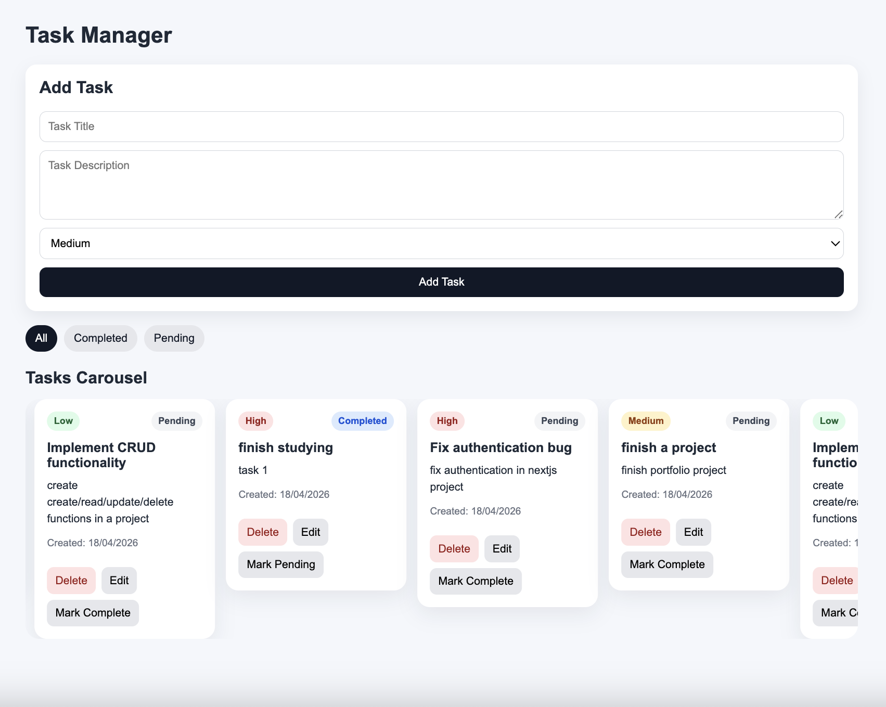

# Task Manager App

## Overview

This is a full-stack Task Manager application built with **React (frontend)** and **Express.js (backend)**.  
Users can create, view, update, delete, and manage tasks with priority and completion status.

---

## Setup & Installation

### 1. Clone the repository

```bash
git clone https://github.com/likazeikidze/lika_zeikidze_helfy_task
cd lika_zeikidze_helfy_task
```

---

## Backend Setup

```bash
cd backend
npm install
npm run dev
```

Backend runs on:  
[http://localhost:4000](http://localhost:4000)

---

## Frontend Setup

```bash
cd frontend
npm install
npm start
```

Frontend runs on:  
[http://localhost:3000](http://localhost:3000)

---

## API Documentation

Base URL:  
[http://localhost:4000/api/tasks](http://localhost:4000/api/tasks)

### Endpoints

- GET /api/tasks
- POST /api/tasks
- PUT /api/tasks/:id
- DELETE /api/tasks/:id
- PATCH /api/tasks/:id/toggle

---

## Task Model

```js
{
  id: number,
  title: string,
  description: string,
  completed: boolean,
  createdAt: Date,
  priority: "low" | "medium" | "high"
}

```

---

## Features

- Full CRUD functionality for tasks
- Task prioritization (Low, Medium, High)
- Mark tasks as completed or pending
- Filter tasks (All / Completed / Pending)
- Inline task editing
- Infinite carousel UI for task visualization
- Responsive UI with loading and error states

## Assumptions & Design Decisions

- Data is stored in-memory (no database required)
- Simple prompt-based editing used for quick user interaction
- Carousel implemented using CSS animation (no external libraries)
- Tasks are duplicated internally only for carousel rendering purposes (to enable smooth infinite scrolling)
- Focused on core functionality before applying styling

## Time Spent

- Backend: ~1.5 hours
- Frontend logic: ~2 hours
- Carousel & styling: ~1–1.5 hours
- Debugging & polishing: ~1 hour

  **Total: ~5–6 hours**

## Screenshot


